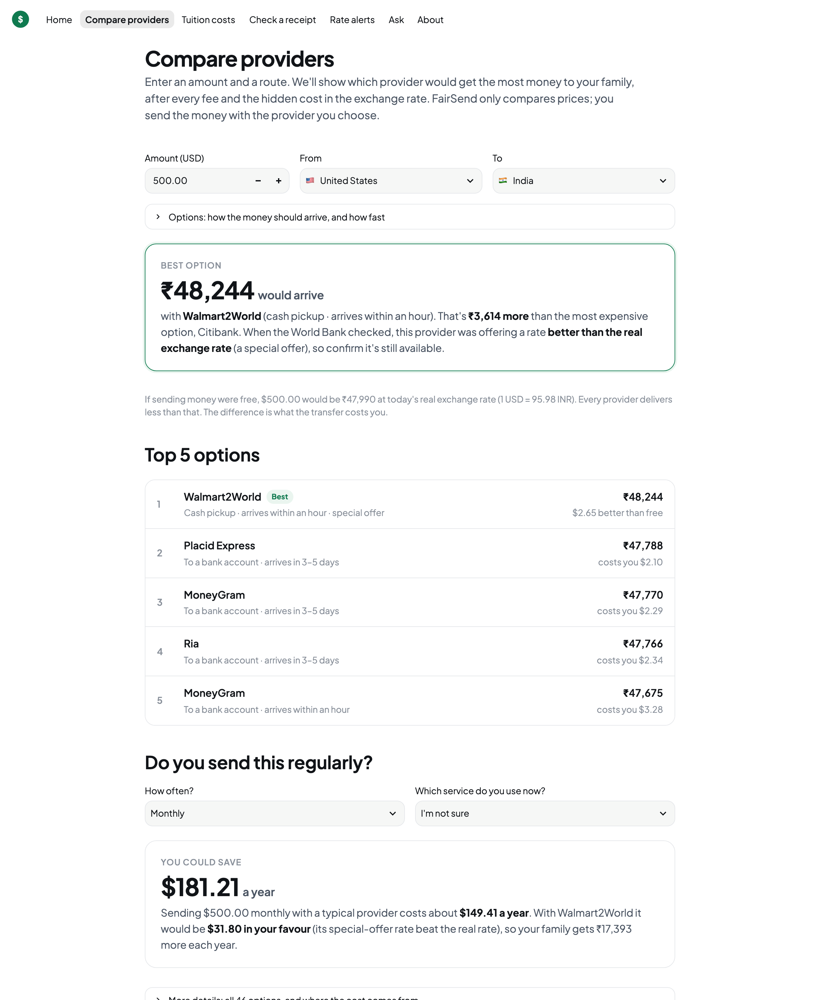
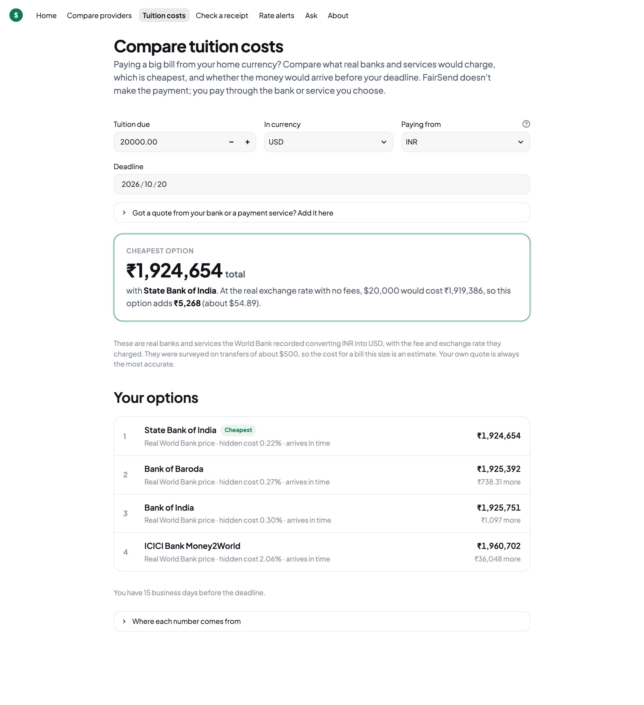
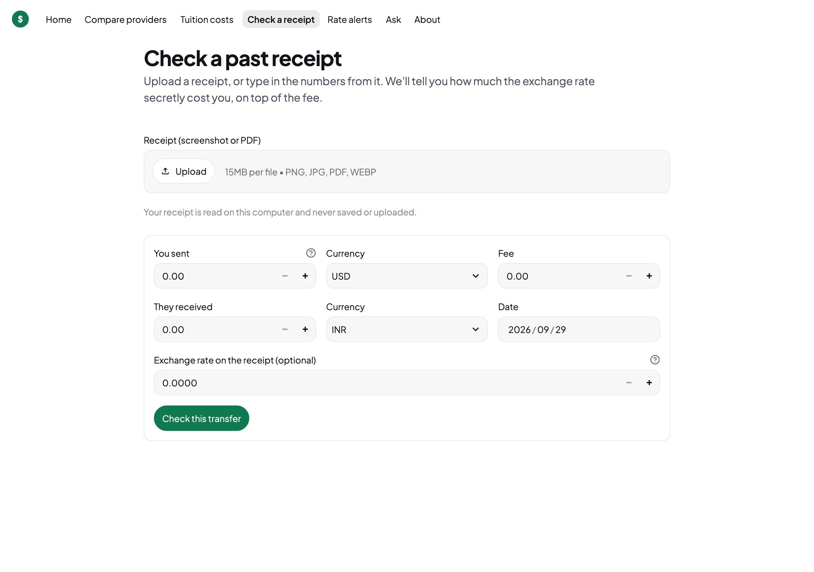
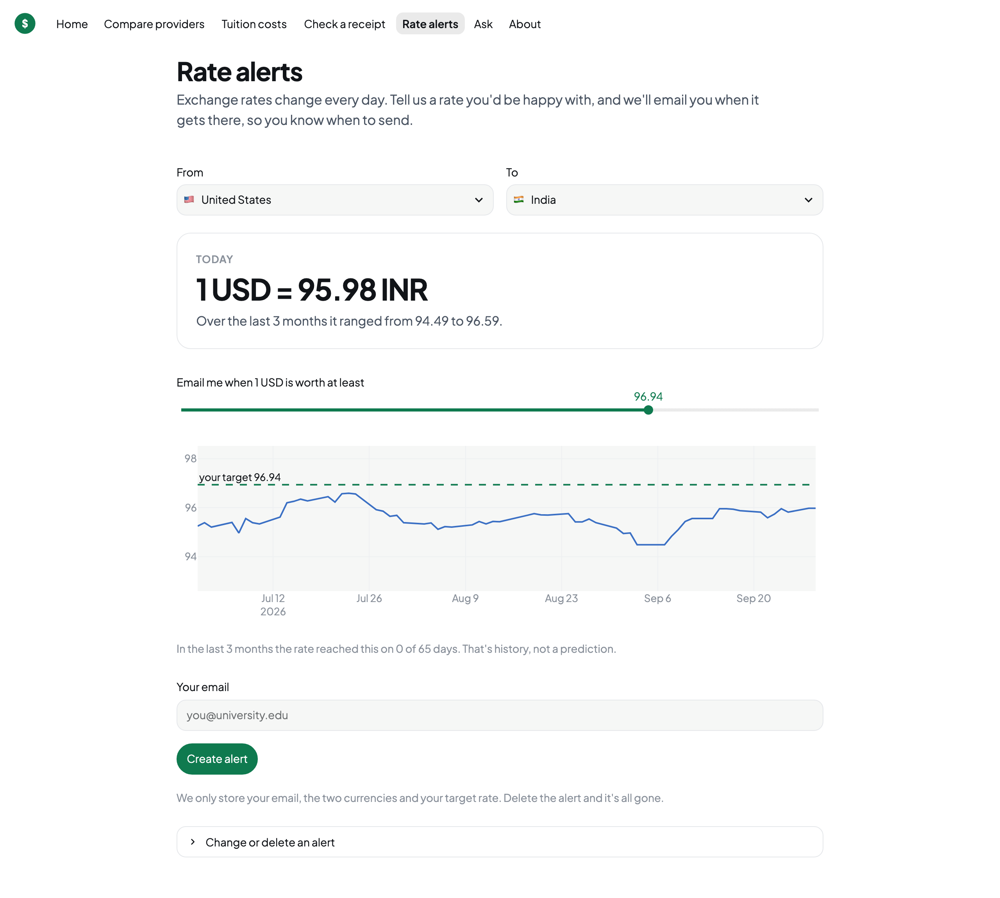

<div align="center">


# FairSend

**See what sending money abroad really costs, and keep more of it.**

### [▶ Try the live demo](https://fairsend.streamlit.app)

[What it does](#what-fairsend-does) · [Screenshots](#screenshots) · [Findings](#what-the-data-shows) · [Try it](#try-it) · [Accuracy](#is-it-accurate)

[](https://fairsend.streamlit.app)


[](https://github.com/RajivPraveen/fairsend/actions/workflows/tests.yml)


</div>

---

## The problem

Every time you send money to another country, you pay **twice**:

| | What it is | Can you see it? |
|---|---|---|
| **The fee** | A charge like "$3.99 per transfer" | ✅ Yes |
| **The exchange rate** | The provider gives you a worse rate than the real one and keeps the difference | ❌ Usually not |

That second cost is where most people lose money. A "zero-fee" transfer often just moves the cost into the rate.

> **Real example:** sending $500 from the US to India, the best provider delivers **₹48,244**. The most
> expensive delivers **₹44,631**. Same $500, **₹3,614 less** for your family.

For a student paying **$20,000 in tuition**, a 2–3% hidden markup is **$400–$600** gone.

## What FairSend does

FairSend adds up **both** costs for every provider, using real prices, and shows you what would actually arrive.
It's a **comparison tool**: it doesn't send or hold money. You pick a provider, then send with them directly.

| | Feature | In one line |
|---|---|---|
| 💸 | **Compare providers** | Ranks every provider on your route by how much your family would actually receive |
| 🎓 | **Tuition costs** | Compares what banks and services would charge to pay a big bill from home, and whether it would arrive before the deadline |
| 🧾 | **Check a receipt** | Upload a past receipt and see how much the exchange rate secretly cost you |
| 🔔 | **Rate alerts** | Get an email when the exchange rate reaches a number you choose |
| 💬 | **Ask** | Plain answers about fees, rates and your rights, from official sources only |

**Built for international students**, who pay tuition, rent and bills across borders, and for anyone sending money
home to family.

## Screenshots

<table>
<tr>
<td width="50%"><br/><sub><b>Compare providers:</b> every provider ranked by what would arrive</sub></td>
<td width="50%"><br/><sub><b>Tuition costs:</b> real banks for your currency pair, and whether it arrives in time</sub></td>
</tr>
<tr>
<td width="50%"><br/><sub><b>Check a receipt:</b> the hidden cost of a transfer you already made</sub></td>
<td width="50%"><br/><sub><b>Rate alerts:</b> an email when the rate reaches your target</sub></td>
</tr>
</table>

## How it works

```
  Real prices                    Real exchange rate                 Your answer
  ───────────                    ──────────────────                 ───────────
  The World Bank checks    +     The European Central Bank's   =    What actually arrives
  what hundreds of               daily rate, the one banks          with each provider,
  providers really charge,       trade at                           and which is cheapest
  every quarter
  (254,000 prices since 2011)
```

The gap between a provider's rate and the real rate is the **hidden cost**. FairSend measures it for every provider,
adds the fee, and ranks them.

## What the data shows

From every price the World Bank has collected since 2011 (378 routes, 869 providers):

| Finding | |
|---|---|
| Average cost of sending $200 worldwide | **6.1%** (the UN's goal for 2030 is **3%**) |
| Share of that cost hidden in the exchange rate | **31%** |
| Routes that meet the UN goal | only **10%** |
| Priciest vs. cheapest provider on a typical route | **7×** |
| Saved on a $20,000 tuition payment by choosing the cheapest option over the average bank | **$258** (median) |

Full analysis with charts: [reports/global_remittance_costs.md](reports/global_remittance_costs.md)

**Always up to date:** every Monday a scheduled job checks the World Bank's data catalog. When a new quarter is
published, it downloads it, rebuilds the database, runs the quality checks, and republishes the data the online
demo uses.

## Try it

**Online:** [fairsend.streamlit.app](https://fairsend.streamlit.app), no install needed. It uses the same real data,
refreshed weekly. The AI features (written answers, AI receipt reading) run only on your own computer, so the online
demo uses the rule-based receipt reader and shows the matching official passage for questions.

**On your computer**, for everything including the private local AI. You need Python 3.11, [Ollama](https://ollama.com) (for the AI features), and Tesseract (for reading receipts).

```bash
make setup                  # install everything
ollama pull qwen3.5:4b      # the local AI model (3.4 GB, open source)
make data                   # download the World Bank data and build the database (~2 min)
make app                    # open http://localhost:8501
```

## Which AI model?

FairSend uses **Qwen 3.5 4B**, a small open-source model that runs entirely on your laptop through Ollama. We tested
it against Mistral 7B on the same questions and receipts:

| | Qwen 3.5 4B (default) | Mistral 7B |
|---|---|---|
| Answer speed | **5.3 s** | 9.2 s |
| Answers correct, with the right source | 84% | 89% |
| Receipts read correctly | 99.6% | 99.6% |

Qwen is about **twice as fast** for a small loss in answer accuracy. To use Mistral instead, set
`FAIRSEND_LLM_MODEL=mistral:7b-instruct` in `.env`.

## Private by design

- 🔒 **Receipts** are read on your computer and never saved or uploaded
- 🔒 **Questions** are answered by an AI model running on your computer
- 🔒 **Alerts** store only your email, two currencies and a target. Delete it and it's gone
- 🔒 **No tracking**, no analytics, no accounts

## Is it accurate?

Every part is tested. The full results are in [eval/RESULTS.md](eval/RESULTS.md).

| What we tested | Result |
|---|---|
| Cost math: hand-checked cases, and matching the World Bank's published global average exactly | ✅ All pass (6.36% = 6.36%) |
| Rate alerts fire exactly when they should, and never when they shouldn't | ✅ All pass |
| Reading receipts: 40 test receipts it had never seen | **99.6%** of fields correct · **97.5%** of receipts fully correct |
| Answering questions: 45 reviewed questions | **84%** correct with the right source · **100%** of off-topic and advice questions politely declined |
| Data quality: 17 checks on every refresh | **99.9%** of rows pass |

## Honest limits

- The World Bank checks prices every few months, on transfers of about **$200 and $500**. For other amounts, and
  for today's rate, FairSend **estimates** from those real prices, and labels every estimate.
- Big payments like tuition are less certain, so add your bank's own quote for an exact answer.
- The receipt tests use generated receipts with known answers. Real receipts vary more.
- This is information, **not financial advice**. Always check the provider's quote before you pay.

---

<details>
<summary><b>For developers</b>: architecture, commands, and project layout</summary>

### Architecture

```
World Bank xlsx ─► clean & check (17 quality rules) ─► SQLite ◄─ ECB rates (Frankfurter API)
                                                         │
Streamlit app ◄──────────────────────────────────────────┘
   ├─ cost model: fee + (real rate − provider rate) × amount
   ├─ receipts: Tesseract OCR ─► local AI (Ollama) + rule-based cross-check
   ├─ Ask: MiniLM embeddings ─► FAISS search ─► local AI answer with citations
   └─ alerts: daily job (Dagster or cron) ─► email / Telegram
```

Details and every design decision: [docs/methodology.md](docs/methodology.md) · Privacy: [docs/privacy.md](docs/privacy.md)

### Commands

```bash
fairsend compare USA IND 500   # compare providers in the terminal
fairsend update                # download a new World Bank quarter if there is one, then rebuild
fairsend pipeline              # rebuild from the local World Bank file (skips if unchanged)
fairsend fx && fairsend alerts # refresh rates, then send due alerts
fairsend report                # rebuild the global cost report
make test                      # unit and scenario tests
make eval                      # receipt + Ask accuracy tests -> eval/RESULTS.md
dagster dev -f orchestration/dagster_defs.py   # scheduled jobs
```

Configuration (email, Telegram, AI model) lives in `.env`; see `.env.example`.

### Project layout

```
fairsend/        core package: data pipeline, cost model, comparison, tuition, receipts, alerts, Ask, analysis
app/             the web app (Streamlit): one file per page in app/views/
data/reference/  country → currency tables, provider name aliases
eval/            accuracy tests for receipts and Ask, with results
reports/         global remittance cost report and charts
research/        user study kit: surveys, session script, analysis
orchestration/   scheduled jobs (Dagster, cron)
docs/            methodology and privacy
tests/           automated tests
```

### Tech

Python · SQL (SQLite) · pandas · Streamlit · Plotly · Tesseract · Ollama (Qwen 3.5 4B) · sentence-transformers ·
FAISS · Dagster · Frankfurter API

</details>

<details>
<summary><b>Data sources and credits</b></summary>

- **World Bank**, *Remittance Prices Worldwide* (CC BY 4.0)
- **European Central Bank** reference rates, via [Frankfurter](https://frankfurter.dev)
- [fawazahmed0/exchange-api](https://github.com/fawazahmed0/exchange-api) for currencies the ECB doesn't publish
- **U.S. Consumer Financial Protection Bureau** rules and guidance (public domain)
- **UN** Sustainable Development Goal 10.c metadata

</details>

---

<div align="center"><sub>MIT License · Built by <a href="https://github.com/RajivPraveen">Rajiv Praveen</a></sub></div>
