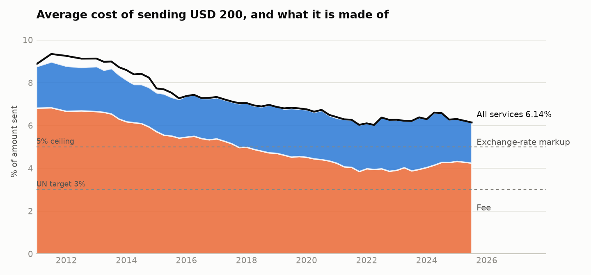
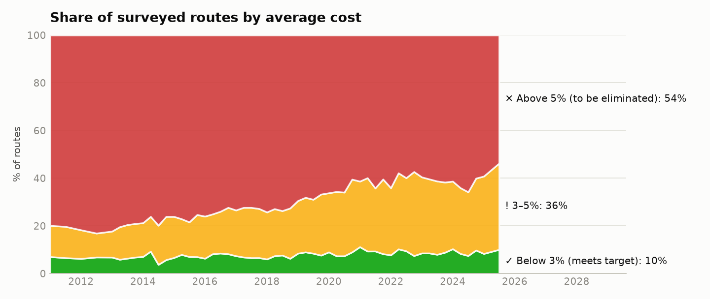
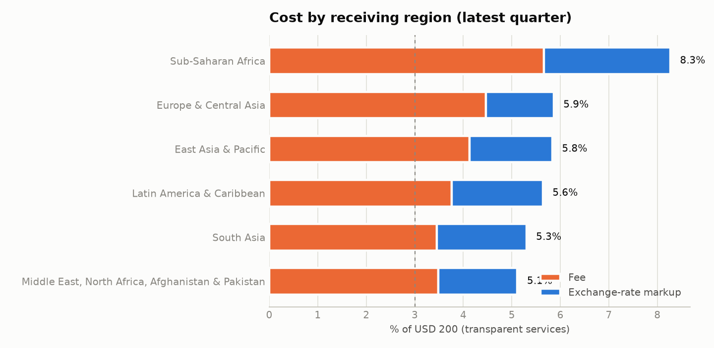
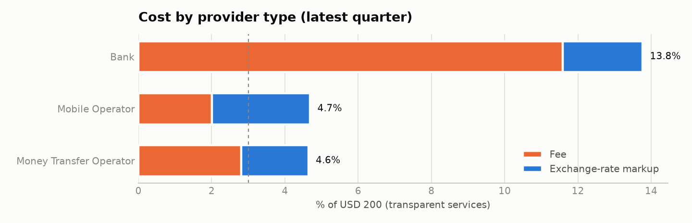

# How affordable are remittances? Global costs against the UN 2030 target

*FairSend analysis of the World Bank's Remittance Prices Worldwide data, 2011 1Q to 2025 3Q.
Generated September 29, 2026.*

## Summary

- **The world is about twice the target.** Sending the equivalent of USD 200 cost **6.14%** on
  average in 2025 3Q (after quality checks), against the UN's 3% goal for 2030. That is down from
  9.11% in 2011.
- **Few routes meet the target.** Only **10%** of the 343 routes surveyed in 2025 3Q average
  below 3%, and **55%** still average above the 5% ceiling that SDG 10.c says should be eliminated.
  At the level of individual services, 32% cost under 3%, so cheap options exist on many routes.
- **About 31% of the cost is hidden in the exchange rate.** Among services that disclosed their rate, the
  average fee was 4.25% of USD 200 and the average exchange-rate markup was 1.89%.
- **"Zero fee" is not free.** 10% of services charged no fee on USD 200, but their average markup was
  1.94%, slightly *higher* than the 1.88% of services that charge a fee.
- **Provider choice matters more than anything else.** On a typical route the most expensive service costs
  **7.3×** the cheapest (median over routes with at least five services). On one route in ten the gap is
  25× or more.
- **Banks cost about three times as much as money transfer operators**: 13.8% vs 4.6%.

## Data and method

- **Source:** World Bank *Remittance Prices Worldwide* (CC BY 4.0): 253,594 valid price observations across
  378 routes, 49 sending and 111 receiving countries, and 869 providers
  (after name standardization), over 54 survey periods (15 years).
- **Cost measure:** the World Bank's total cost of sending USD 200 = fee ÷ amount + exchange-rate margin against the interbank
  rate. Averages are simple averages across services, as in the World Bank's Global Average.
- **Markup shares** use transparent services only. When a provider does not disclose its rate, the survey records a 0% margin,
  which would understate markups.
- **Validation against the official figure.** Before any quality exclusions, FairSend reproduces the World Bank's published Global
  Average exactly: 6.36% for Q3 2025 and 6.49% for Q1 2025. The figures in this report exclude 361 rows that fail hard quality
  checks (for example, total costs above 100% or rates more than 50% from interbank), which lowers the latest average slightly:

| Period | FairSend, all rows (%) | FairSend, after quality checks (%) |
|---|---|---|
| 2025_3Q | 6.36 | 6.14 |
| 2025_1Q | 6.49 | 6.30 |
| 2024_4Q | 6.26 | 6.28 |

## 1. Progress over time

The black line is the average over all services; the shaded areas split the average of services that disclosed their rate into
fee and markup. The average cost has fallen steadily but slowly: a straight-line trend since mid-2015 (-0.14 points a year)
points to about **5.4% in 2030**, far from the 3% target. Fees have fallen faster than markups, so the share of the cost hidden in the
exchange rate rose from 22% in 2011 to a peak of
38% (2022) and is 31% today.

## 2. How many routes meet the target

## 3. Where people pay the most

Most expensive routes in 2025 3Q (average across services):

| From | To | Average % | Cheapest % | Services |
|---|---|---|---|---|
| Tanzania | Uganda | 62.68 | 1.30 | 10 |
| Tanzania | Kenya | 59.99 | 0.72 | 12 |
| France | Algeria | 45.13 | 45.13 | 1 |
| Tanzania | Rwanda | 45.10 | 7.81 | 6 |
| Türkiye | Bulgaria | 34.28 | 13.20 | 4 |
| Senegal | Mali | 25.70 | 1.50 | 6 |
| United Arab Emirates | Sudan | 25.58 | 2.97 | 4 |
| South Africa | China | 23.88 | 3.76 | 11 |
| Qatar | Sudan | 23.20 | 2.23 | 3 |
| Brazil | Bolivia | 22.59 | 5.79 | 8 |

Cheapest routes:

| From | To | Average % | Services |
|---|---|---|---|
| Malaysia | Myanmar | 0.24 | 7 |
| Kuwait | Pakistan | 0.35 | 21 |
| Bahrain | Pakistan | 0.92 | 7 |
| Belgium | Algeria | 1.29 | 6 |
| Qatar | Pakistan | 1.33 | 6 |
| Australia | Pakistan | 1.77 | 25 |
| United Kingdom | India | 1.91 | 28 |
| United Kingdom | Nigeria | 1.96 | 31 |
| United Arab Emirates | Pakistan | 2.17 | 17 |
| Bahrain | India | 2.17 | 10 |

Average cost by sending country (countries with 50+ services surveyed in 2025 3Q):

| Sending country | Average % | Markup share % | Services |
|---|---|---|---|
| South Africa | 14.59 | 12.80 | 270 |
| Kenya | 12.41 | 22.11 | 89 |
| Thailand | 11.58 | 17.80 | 128 |
| Japan | 9.98 | 11.39 | 142 |
| Italy | 7.51 | 15.93 | 416 |
| Sweden | 6.93 | 35.95 | 59 |
| Switzerland | 6.69 | 39.20 | 57 |
| New Zealand | 6.04 | 39.17 | 225 |
| Saudi Arabia | 5.52 | 37.18 | 120 |
| Netherlands | 5.52 | 30.85 | 175 |
| Spain | 5.37 | 37.39 | 216 |
| Canada | 5.28 | 46.19 | 264 |
| Australia | 5.24 | 41.14 | 347 |
| France | 5.23 | 25.61 | 256 |
| United States | 5.07 | 27.16 | 1008 |
| United Kingdom | 4.61 | 54.43 | 791 |
| Malaysia | 4.49 | 50.86 | 182 |
| Germany | 4.49 | 33.05 | 490 |
| Austria | 4.43 | 24.56 | 130 |
| United Arab Emirates | 4.36 | 35.24 | 149 |
| Singapore | 4.02 | 42.14 | 210 |
| Belgium | 3.57 | 43.77 | 64 |
| Norway | 3.53 | 39.67 | 72 |
| Kuwait | 3.34 | 46.00 | 156 |

## 4. Who charges what

Digital vs non-digital services:

| Channel | Average % | Fee % | Markup % | Markup share % | Services |
|---|---|---|---|---|---|
| Digital (online/mobile) | 4.57 | 2.71 | 1.87 | 40.84 | 4413 |
| Non-digital | 9.54 | 7.60 | 1.94 | 20.29 | 2036 |

## 5. The same transfer, very different prices

Routes with the widest gap between the cheapest and most expensive service in 2025 3Q:

| From | To | Cheapest % | Most expensive % |
|---|---|---|---|
| Tanzania | Kenya | 0.72 | 88.35 |
| Tanzania | Uganda | 1.30 | 88.69 |
| Tanzania | Rwanda | 7.81 | 93.22 |
| Japan | Philippines | 2.06 | 65.23 |
| Japan | China | 3.57 | 60.68 |
| Sweden | India | 0.72 | 50.72 |
| Spain | Bolivia | 3.76 | 51.32 |
| South Africa | Malawi | -3.00 | 44.40 |

## Data quality

Every pipeline run applies these checks. "Error" rows are excluded; "warning" rows are kept and flagged.

| Check | Severity | Rows failed | Pass rate % |
|---|---|---|---|
| duplicate_id | error | 5 | 100.00 |
| implausible_fx_margin | error | 184 | 99.93 |
| impossible_total_cost | error | 143 | 99.94 |
| interbank_vs_ecb | warning | 978 | 99.61 |
| margin_inconsistent | warning | 1940 | 99.24 |
| missing_200_cost | error | 138 | 99.95 |
| missing_500_cost | warning | 1282 | 99.50 |
| missing_key_fields | error | 0 | 100.00 |
| negative_fee | error | 0 | 100.00 |
| negative_fx_margin | warning | 10806 | 95.74 |
| non_transparent | warning | 7418 | 97.08 |
| nonpositive_amount | error | 103 | 99.96 |
| nonpositive_rate | error | 1 | 100.00 |
| nonstandard_currency_code | warning | 457 | 99.82 |
| total_cost_inconsistent | warning | 139 | 99.95 |
| unknown_receive_currency | error | 0 | 100.00 |
| unknown_speed | warning | 10 | 100.00 |

## Limitations

- World Bank prices are quarterly mystery-shopping snapshots at two amounts (USD 200 and 500). Prices change often, and the
  survey does not cover every provider or product.
- Simple averages weight every surveyed service equally, regardless of how much money flows through it. The World Bank also
  publishes a flow-weighted average, which is lower.
- Services that do not disclose their exchange rate are recorded with a 0% margin, which understates their cost.
- The payout currency is not recorded in the dataset. FairSend infers it from the interbank rate. This affects consumer-facing
  estimates in the app, not the percentages in this report.
